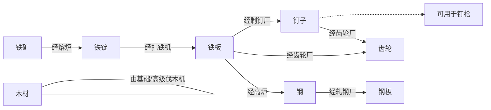

# 介绍

Halo,这是我关于像素工厂的教程项目。

你可以在b站上看到这一系列的教程。

这里是源码，可以作为参考。

# Introduction

Hi I'm Azazel. This is my tutorial of Mindustry.

You can see the Video on BiliBili Website. You can search "翎肆忤鸠".

This is source code,you can view these codes to study how to develop a mod in Mindustry.

# Here is Items & Blocks RelationShip map
# 这里是物品工厂关系对照表

# Mindustry Java Mod Template
A Java Mindustry mod template that works on Android and PC. The Kotlin version of this mod can be seen [here](https://github.com/Anuken/MindustryKotlinModTemplate).

## Building for Desktop Testing

1. Install JDK **17**.
2. Run `gradlew jar` [1].
3. Your mod jar will be in the `build/libs` directory. **Only use this version for testing on desktop. It will not work with Android.**
To build an Android-compatible version, you need the Android SDK. You can either let Github Actions handle this, or set it up yourself. See steps below.

## Building through Github Actions

This repository is set up with Github Actions CI to automatically build the mod for you every commit. This requires a Github repository, for obvious reasons.
To get a jar file that works for every platform, do the following:
1. Make a Github repository with your mod name, and upload the contents of this repo to it. Perform any modifications necessary, then commit and push. 
2. Check the "Actions" tab on your repository page. Select the most recent commit in the list. If it completed successfully, there should be a download link under the "Artifacts" section. 
3. Click the download link (should be the name of your repo). This will download a **zipped jar** - **not** the jar file itself [2]! Unzip this file and import the jar contained within in Mindustry. This version should work both on Android and Desktop.

## Building Locally

Building locally takes more time to set up, but shouldn't be a problem if you've done Android development before.
1. Download the Android SDK, unzip it and set the `ANDROID_HOME` environment variable to its location.
2. Make sure you have API level 30 installed, as well as any recent version of build tools (e.g. 30.0.1)
3. Add a build-tools folder to your PATH. For example, if you have `30.0.1` installed, that would be `$ANDROID_HOME/build-tools/30.0.1`.
4. Run `gradlew deploy`. If you did everything correctlly, this will create a jar file in the `build/libs` directory that can be run on both Android and desktop. 

## Adding Dependencies

Please note that all dependencies on Mindustry, Arc or its submodules **must be declared as compileOnly in Gradle**. Never use `implementation` for core Mindustry or Arc dependencies. 

- `implementation` **places the entire dependency in the jar**, which is, in most mod dependencies, very undesirable. You do not want the entirety of the Mindustry API included with your mod.
- `compileOnly` means that the dependency is only around at compile time, and not included in the jar.

Only use `implementation` if you want to package another Java library *with your mod*, and that library is not present in Mindustry already.

--- 

*[1]* *On Linux/Mac it's `./gradlew`, but if you're using Linux I assume you know how to run executables properly anyway.*  
*[2]: Yes, I know this is stupid. It's a Github UI limitation - while the jar itself is uploaded unzipped, there is currently no way to download it as a single file.*
